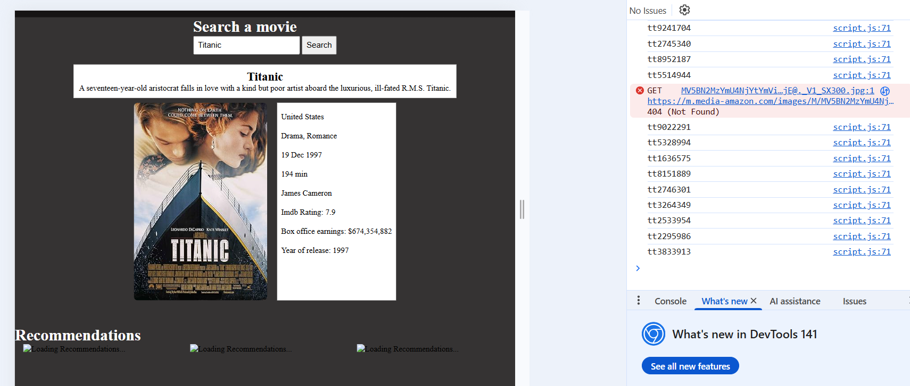

<h1 align="center">FILM DB</h1>

  <h3>
    <a href="https://ande-glitch.github.io/FilmDB/index.html">
      Link to project
    </a>
  </h3>

<!-- TABLE OF CONTENTS -->

## Table of Contents

- [Overview](#overview)
- [Built With](#built-with)
- [Features](#features)
- [How to use](#how-to-use)
- [Contact](#contact)

<!-- OVERVIEW -->
## Overview
- En nettside som bruker OMDb API og henter / fetcher data til bruk av anbefalinger.

## Hvordan Brukes?
- På søk feltet, søk på en film, så vil det vises på skjermen.

## Features
- API call
- Kvalitets sjekk
- Algoritmisk sortering av data
- Dynamisk

## Utfordringer
- Algoritmisk sortering / kvalitets sjekk av bilder
- API daglig begrensning på 1000 forespørsel (Viktig) 

## Løsning
- Samarbeid
- Hjelp av klassekamerater
- KI / AI

## Dokumentasjon
- Hvordan brukte jeg API?

Vi fikk tilordnet API ved OMDbAPI med API nøkkel, dermed følgte vi det tekniske dokumentasjon blant API-en og dermed kunne hente data om filmer, serier og lignede. Med det informasjonen kunne vi utføre utføre en algoritme som lagde at vi genererte en imdb ID til å hente en tilfeldig film, og vise det på skjermen dersom det utførte visse krav som "Har en tittel, har en bilde og har en sjanger". 

Utfordringene kom fra hvordan vi skulle hente / verifisere dataen vi henter. En eksempel av dette er hvordan vi skulle fortsette å generere imdb ID-er og dermed vise det på skjermen dersom det fullføre det kravene vi har satt om. I dette tilfellet kom KI generert råd til masse bruk. 

- UU

Ved UU (Universal utforming) står det vedlagt alternativ tekst til å forklare bildene som er viktig, og dermed står det labels som representerer dataen som er markert. I tillegg, vi filmene som kommer som anbefaling ha alternativ tekst som står vedlagt tittelen på filmen.

- Feilhåndtering

Det står noen tiltak til å unngå feil underveis. Hvis API-en går for lenge uten å få svar, vil det finnes en "Dead Interval" som økes med hver feil og har maksimalt verdi av 100 før koden stopper. I tillegg; verifisering av data som hentes av API-en står vedlagt resultat via konsolen med Get 404 error og antall søk med tilfeldige imdb ID-er.

- Utfordringer 

Det var veldig vanskelig å bygge algoritmen som verifiserte bildene i forhånd før det vises på skjermen. Det var her KI var brukt mest i kode-prosessen. Til slutt ga dette resultat på en sakte prosesse til å hente data som skulle vises på skjermen, men dermed verifiserte bildene i forhånd. 

- Kjøring

Når koden kjøres vil det først hente dataen ifølge input boksen, og dermed når den henter anbefalinger vil det først kjøre en kode som generer tilfeldige imdb ID-er, dermed verifisere den, legg den til en data-array, og til slutt kjøre en kode som lager at bildene vises på skjermen.

## Contact
- GitHub [Ande-Glitch](https://github.com/Ande-glitch)
- Epost [And Nguyen](mailto:andynuwen@gmail.com)

## Result

